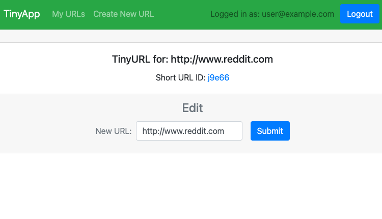

# TinyApp Project

TinyApp is a full stack web application built with Node and Express that allows users to shorten long URLs (à la bit.ly).

## Purpose

This project was created and published by [Jerome Lagbas](https://github.com/jeromealmir) as part of the Web Development program at Lighthouse Labs.

## Final Product

|  | 
|:--:| 
| *Login Page* |

|  | 
|:--:| 
| *Register Page* |

|  | 
|:--:| 
| *TinyApp Homepage (Empty)* |

|  | 
|:--:| 
| *TinyApp Homepage* |

|  | 
|:--:| 
| *Create New URL* |

|  | 
|:--:| 
| *Edit URL* |

|  | 
|:--:| 
| *403 Forbidden Page* |

|  | 
|:--:| 
| *404 Not Found Page* |

## Dependencies

- Node.js
- Express
- EJS
- bcryptjs
- cookie-session

## Getting Started

- Install all dependencies (using the `npm install` command).
- Run the development web server using the `node express_server.js` command.

## How To Use

- Run local server `npm start`
- Browse to `http://localhost:8080`
- Login or register an account
- `My URLs` displays all URLs you have created
- To create new URL click on `Create New URL`
- Enter the website address you wish to shorten
- Use your shortened URL by going to `localhost:8080/u/` + `short URL ID`
- Modify URL by clicking `Edit`
- Delete URL by clicking `Delete`
- Access or share your TinyURL URL anywhere

## Features

- Simple user database (supports unlimited user registration and URL creation)
- Secured user registration using hash technology (powered by bcrypt)
- Supports user-session using cookies (login and logout)
- Encrypted cookies session (powered by cookie-session)
- User authenticated URLs (protects unauthorized modification and deletion)
- Protected POST routes
- Responsive web design (mobile view supported)
- Custom error pages (403 and 404)

